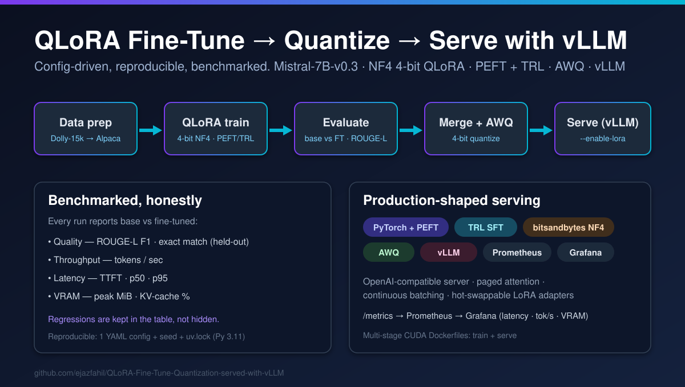

<p align="center">
  
</p>

<h1 align="center">QLoRA Fine-Tune + Quantization, served with vLLM</h1>

<p align="center">
  <em>A clean, config-driven, <strong>benchmarked</strong> fine-tuning pipeline:</em><br>
  QLoRA fine-tune → evaluate → merge → AWQ quantize → deploy on vLLM, with rigorous before/after metrics.
</p>

<p align="center">
  
  
  
  
  
  <a href="https://github.com/ejazfahil/QLoRA-Fine-Tune-Quantization-served-with-vLLM/actions/workflows/ci.yml"></a>
</p>

---

## 🎯 Aim

Take a 7B base model and run the **full enterprise fine-tuning loop** the way it
would be done in production — not at toy scale, but with **clean methodology and
reproducible benchmarks**:

> **QLoRA fine-tune → evaluate (base vs. fine-tuned) → merge → 4-bit quantize →
> serve on vLLM**, measuring quality, throughput, latency, and VRAM at every step,
> and writing up the tradeoffs **honestly — including where fine-tuning didn't help.**

Fine-tuning is the high-leverage enterprise skill; the emphasis here is rigor and
reproducibility, not raw GPU count.

## 🧭 Context

This is **Project 3** of a three-part production MLOps blueprint (RAG agent →
eval/observability harness → this). It deliberately uses an **EU-friendly open
base** (`mistralai/Mistral-7B-v0.3`) with `meta-llama/Llama-2-7b-hf` selectable by
config, and the standard **Hugging Face PEFT + TRL** training path with
**bitsandbytes** 4-bit NF4 QLoRA.

> **Dev environment note (full transparency).** This repo was authored and
> smoke-tested on an **Apple-Silicon Mac (no NVIDIA GPU)**. The core stack —
> bitsandbytes 4-bit, AWQ, and vLLM — is **CUDA-only**, so real training/serving
> runs on a GPU box. To prove the wiring without burning GPU hours, the entire
> pipeline runs locally on a **tiny 135M model on CPU** (`make smoke`). Benchmark
> tables therefore ship **methodology-first** with `PENDING GPU RUN` placeholders
> that the documented commands populate on any CUDA GPU. No numbers are fabricated.

## ✅ Achievements / Definition of Done

- [x] **Config-driven training** — one `configs/*.yaml` drives the whole pipeline
      (rank, alpha, dropout, target modules, lr, epochs, **seed**).
- [x] **QLoRA** — bitsandbytes 4-bit **NF4 + double quantization**, CUDA-gated so
      it degrades gracefully to plain LoRA on CPU for smoke testing.
- [x] **TRL `SFTTrainer` + PEFT** path with packing, gradient checkpointing, and
      bf16 — OOM hygiene built in.
- [x] **Reproducible** — pinned Python 3.11 + **`uv.lock`** + global seed +
      `split_meta.json` per run.
- [x] **Benchmark harness** — `base vs. fine-tuned` on a held-out test set
      (ROUGE-L / exact-match) **and** serving throughput / TTFT / p50-p95 latency /
      VRAM under vLLM.
- [x] **Adapter artifacts** with `adapter_config.json`; documented **merge** step
      (`merge_and_unload`) and the **merge-vs-serve-adapter** tradeoff.
- [x] **AWQ 4-bit** quantization of the merged model for vLLM.
- [x] **vLLM serving** script (`--enable-lora --lora-modules … --max-lora-rank …`)
      + a thin async streaming client exposing TTFT/throughput.
- [x] **Observability** — vLLM `/metrics` → Prometheus → **Grafana dashboard**
      (latency p50/p95/p99, tok/s, KV-cache/VRAM).
- [x] **Dockerized** — multi-stage CUDA `Dockerfile.train` + `vllm/vllm-openai`
      `Dockerfile.serve` + `docker-compose` (vLLM + Prometheus + Grafana).
- [x] **Locally verified** — `ruff` ✓ `mypy` ✓ `pytest` (14) ✓ +
      end-to-end `make smoke` and a real base-vs-FT eval table on the tiny model.

## 🏗️ Architecture

```
                          configs/*.yaml  (one source of truth + seed)
                                   │
        ┌──────────┬───────────────┼───────────────┬─────────────────┐
        ▼          ▼               ▼               ▼                 ▼
   data/        train/          eval/           export/           serve/
 prepare_data   train.py      benchmark.py   merge_weights.py   launch_vllm.sh
   (Dolly →    (PEFT+TRL,       metrics.py     quantize.py        client.py
   Alpaca,    NF4 4-bit QLoRA) (base vs FT,   (merge_and_unload, (vLLM OpenAI,
   seeded      ──► adapter/    ROUGE-L,         AWQ 4-bit)        --enable-lora,
   splits)    adapter_config   tok/s, p50/95,                    streaming TTFT)
                   .json        VRAM)                                 │
                                                                      ▼
                                              vLLM /metrics → Prometheus → Grafana
```

**Flow:** `prepare_data` normalises Dolly-15k into a documented Alpaca instruction
schema with seeded train/val/test splits → `train.py` fits a LoRA adapter on the
4-bit NF4 base via TRL `SFTTrainer` → `benchmark.py` scores **base vs. base+adapter**
→ `merge_weights.py` folds the adapter in (`merge_and_unload`) → `quantize.py`
produces a 4-bit AWQ checkpoint → `launch_vllm.sh` serves base + adapter routes,
with metrics flowing to Grafana.

### Repository layout
```
configs/         smoke.yaml · mistral7b_qlora.yaml · llama2_7b_qlora.yaml
common/          config.py (typed/validated) · prompt.py (one template, train==eval)
data/            prepare_data.py · schema.md · sample.jsonl
train/           train.py            (QLoRA SFT, CUDA-gated 4-bit, seed, W&B/Trackio)
eval/            benchmark.py · metrics.py   (hf + vllm backends)
export/          merge_weights.py · quantize.py (AWQ)
serve/           launch_vllm.sh · client.py · metrics_notes.md
observability/   prometheus.yml · grafana/ (datasource, provider, dashboard JSON)
docker/          Dockerfile.train (CUDA) · Dockerfile.serve (vllm/vllm-openai)
docs/            benchmarks.md · poster.svg
tests/           config · data · metrics · train-helpers (pytest)
docker-compose.yml · pyproject.toml · uv.lock · Makefile
```

## 🚀 Quickstart

### Dev machine (CPU/MPS — proves the pipeline)
```bash
make setup                 # locked Python 3.11 env (CPU/dev deps)
make data                  # build seeded splits from Dolly-15k
make smoke                 # tiny-model LoRA train end-to-end (no GPU)
make check                 # ruff + mypy + pytest
uv run python -m eval.benchmark --config configs/smoke.yaml --backend hf
```

### GPU box (real run)
```bash
uv sync --extra gpu                                   # bitsandbytes, autoawq, wandb
uv run python -m data.prepare_data --config configs/mistral7b_qlora.yaml
make train    CONFIG=configs/mistral7b_qlora.yaml     # QLoRA → outputs/<run>/adapter
make eval     CONFIG=configs/mistral7b_qlora.yaml     # quality table (base vs FT)
make merge    CONFIG=configs/mistral7b_qlora.yaml     # merge_and_unload
make quantize CONFIG=configs/mistral7b_qlora.yaml     # AWQ 4-bit
make serve    CONFIG=configs/mistral7b_qlora.yaml     # vLLM + LoRA on :8000
uv run python -m eval.benchmark --config configs/mistral7b_qlora.yaml --backend vllm
```

### Serving stack (Docker)
```bash
docker compose up --build      # vLLM (:8000) + Prometheus (:9090) + Grafana (:3000)
```

## 🖥️ GPU requirements

| Stage | Needs | Notes |
| --- | --- | --- |
| QLoRA train (7B, NF4) | **1× GPU ≥ 16 GB** (24 GB comfortable) | bitsandbytes is CUDA-only |
| Merge (fp16) | ~16–20 GB | loads base in fp16, not 4-bit |
| AWQ quantize | 1× GPU + calibration set | AutoAWQ, CUDA-only |
| vLLM serve | 1× GPU; ~14–16 GB (fp16) / ~6–8 GB (AWQ) | paged attention + continuous batching |

> **Llama-2 is gated:** request access on the HF model page and export `HF_TOKEN`
> before using `configs/llama2_7b_qlora.yaml`. Mistral-7B-v0.3 needs no gating.

## 📊 Benchmarks
See **[`docs/benchmarks.md`](docs/benchmarks.md)** for the full methodology, the
`PENDING GPU RUN` results tables, and the honest-tradeoffs section. Local smoke
evidence (tiny model, CPU) is included there to prove the harness end-to-end —
and it already shows a fine-tune **regression**, kept in the table on purpose.

## 🔭 What I'd harden next for real production
1. **Semantic eval, not just ROUGE/EM** — add an LLM-as-judge (groundedness,
   relevance) and a small standard benchmark (e.g. MMLU/GSM8K slices) so quality
   is measured beyond surface overlap.
2. **CI gates** — run `make check` + a GPU smoke job in CI; block merges on a
   quality-regression threshold from `benchmark.json`.
3. **Experiment tracking by default** — wire W&B/Trackio runs to config hashes +
   `uv.lock` digest so every adapter is traceable to exact inputs.
4. **Serving robustness** — autoscaling/replicas, request timeouts + retries,
   speculative decoding, and a canary that compares adapter vs. base online.
5. **Model governance** — signed adapter artifacts, a model registry, dataset
   licence/PII review, and eval-on-promote before an adapter reaches prod.
6. **Cost/perf sweep** — quantization (AWQ/GPTQ/FP8) × batch size × `max-model-len`
   grid to pick the Pareto-optimal serving config per SLA.

---

<p align="center"><sub>Project 3 of 3 · MLOps & LLM Engineering blueprint · built with PEFT · TRL · bitsandbytes · AWQ · vLLM</sub></p>
