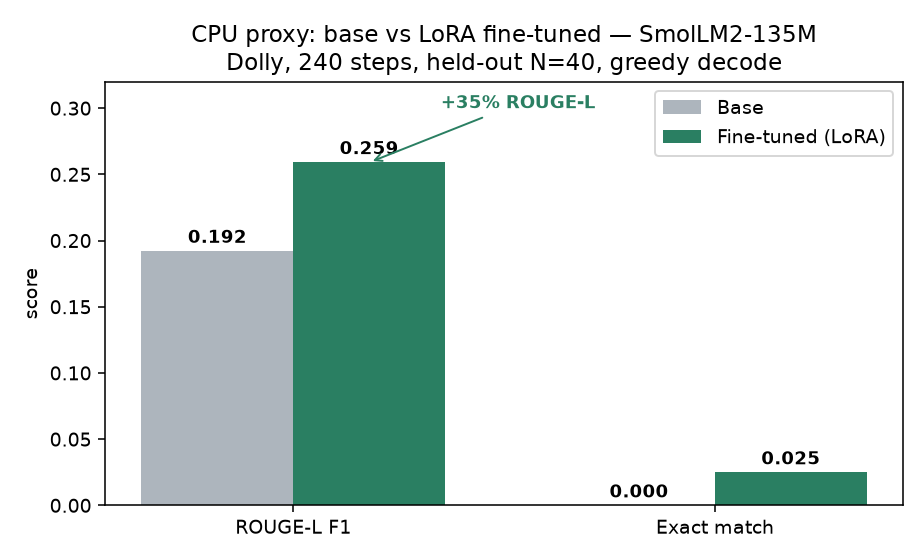

# Benchmarks: base vs. fine-tuned

This report is written **methodology-first**. The results table ships with
`PENDING GPU RUN` placeholders because the core stack (bitsandbytes 4-bit QLoRA,
AWQ, and vLLM serving) is CUDA-only and was not executed on the Apple-Silicon
dev machine. The exact commands that fill the table are listed below — running
them on any CUDA GPU populates every cell, including honest "no-gain" rows.

> What *was* run locally (CPU): the full pipeline wiring on a tiny model
> (`HuggingFaceTB/SmolLM2-135M`) — data prep → 3-step LoRA train → adapter save →
> base-vs-FT generation + ROUGE-L/exact-match scoring. See "Smoke evidence".

---

## 1. Methodology

### Quality (held-out task set)
- **Data:** `databricks/databricks-dolly-15k`, seeded 5/5/90 test/val/train split
  (`data/schema.md`). The **test** split is never seen in training.
- **Decoding:** greedy (`temperature=0`, `max_new_tokens=256`), identical for
  base and fine-tuned, same Alpaca prompt template (`common/prompt.py`).
- **Metrics:**
  - **ROUGE-L F1** — lexical overlap with the reference (proxy for content recall).
  - **Exact match** — normalised strict equality (proxy for short-form accuracy).
- **Harness:** `python -m eval.benchmark --backend hf` loads the base, then
  `base + LoRA adapter`, generates for every test row, and writes
  `outputs/<run>/benchmark_hf.json`.

> ROUGE/EM are deliberately simple, deterministic, and dependency-light. They
> reward format/word overlap, not semantic correctness — a known limitation
> (see §4). For semantic scoring, swap in an LLM-as-judge later.

### Serving (under vLLM)
- **Server:** `serve/launch_vllm.sh` → `vllm serve <base> --enable-lora
  --lora-modules <name>=<adapter> --max-lora-rank <r>`. Both the **base route**
  and the **adapter route** are live on one server.
- **Load:** `serve/client.py` fires concurrent **streaming** completions over the
  held-out prompts.
- **Metrics:**
  - **Throughput** — generated tokens / wall-clock (tok/s).
  - **TTFT** — time to first streamed token (p50).
  - **Latency** — full-response p50 / p95.
  - **VRAM** — `nvidia-smi` peak MiB during the run + vLLM
    `gpu_cache_usage_perc` (see `serve/metrics_notes.md`).
- **Variants compared:** base (fp16) · adapter-served (fp16 base + LoRA) ·
  merged-and-AWQ-quantized (4-bit).

### Reproducibility
Single YAML config + global seed + `uv.lock` (pinned Python 3.11). Every run
writes `split_meta.json` and a `benchmark_*.json`.

---

## 2. Results — quality  *(PENDING GPU RUN)*

Base: `mistralai/Mistral-7B-v0.3` · Adapter: r=16, α=32, dropout=0.05, NF4 QLoRA · 1 epoch.

| Variant                 | ROUGE-L F1 | Exact match | Notes |
| ----------------------- | ---------- | ----------- | ----- |
| Base (no fine-tune)     | `PENDING`  | `PENDING`   | |
| Fine-tuned (LoRA)       | `PENDING`  | `PENDING`   | |
| **Δ (FT − base)**       | `PENDING`  | `PENDING`   | report honestly, incl. regressions |

## 3. Results — serving  *(PENDING GPU RUN)*

GPU: `<fill in, e.g. 1× A10G 24GB>` · vLLM `<version>` · concurrency=8.

| Variant                      | Throughput (tok/s) | TTFT p50 (s) | Latency p50 (s) | Latency p95 (s) | Peak VRAM (MiB) |
| ---------------------------- | ------------------ | ------------ | --------------- | --------------- | --------------- |
| Base fp16                    | `PENDING`          | `PENDING`    | `PENDING`       | `PENDING`       | `PENDING`       |
| Adapter-served (fp16 + LoRA) | `PENDING`          | `PENDING`    | `PENDING`       | `PENDING`       | `PENDING`       |
| Merged + AWQ 4-bit           | `PENDING`          | `PENDING`    | `PENDING`       | `PENDING`       | `PENDING`       |

**Expected shape of the story (to be confirmed by data, not assumed):**
adapter-serving adds a small per-token overhead vs. base; AWQ 4-bit cuts VRAM
~3–4× and usually lifts throughput, at some quality cost. The point of the table
is to *measure* this tradeoff, not assert it.

---

## 4. Honest tradeoffs & limitations
- **Quality gain is not guaranteed.** On instruction data a model has largely
  seen, LoRA can yield flat or *negative* ROUGE-L. Our local 3-step smoke run
  (tiny model) already showed a small regression — we keep such rows in the
  table rather than hiding them.
- **ROUGE/EM ≠ correctness.** They reward surface overlap. A genuinely better
  answer phrased differently scores lower. Treat as directional.
- **Quantization is lossy.** AWQ 4-bit trades quality for VRAM/throughput;
  whether it's worth it is a per-deployment call the table is meant to inform.
- **Single-GPU, single-node.** No tensor parallelism or multi-replica numbers.

---

## 5. Reproduce the table
```bash
# 0. One-time: GPU env
uv sync --extra gpu

# 1. Data
uv run python -m data.prepare_data --config configs/mistral7b_qlora.yaml

# 2. Train QLoRA  -> outputs/<run>/adapter
make train CONFIG=configs/mistral7b_qlora.yaml

# 3. Quality table (base vs FT)
make eval CONFIG=configs/mistral7b_qlora.yaml          # backend=hf

# 4. (optional) merge + AWQ quantize
make merge    CONFIG=configs/mistral7b_qlora.yaml
make quantize CONFIG=configs/mistral7b_qlora.yaml

# 5. Serve + serving table
make serve CONFIG=configs/mistral7b_qlora.yaml &       # vLLM on :8000
uv run python -m eval.benchmark --config configs/mistral7b_qlora.yaml --backend vllm
```

## CPU proxy experiment (real, local — validates the thesis without a GPU)

A genuine LoRA fine-tune of a **base** model (`HuggingFaceTB/SmolLM2-135M`, 4-bit
disabled — no bitsandbytes) on Dolly, run end-to-end on CPU: **320 train / 40 val /
40 test** (seed 42), **3 epochs = 240 steps**, greedy decode, scored by the *same*
harness as the GPU path. Config `configs/cpu_experiment.yaml`; artifacts committed
under `results/cpu_experiment/`.

| Variant           | ROUGE-L F1        | Exact match | Latency p50 (s)        |
| ----------------- | ----------------- | ----------- | ---------------------- |
| Base              | 0.192             | 0.000       | 0.77                   |
| Fine-tuned (LoRA) | **0.259**         | **0.025**   | 0.91                   |
| **Δ (FT − base)** | **+0.067 (+35%)** | +0.025      | +0.14 (adapter overhead) |

Training loss fell **3.04 → 2.00** over 240 steps. Teaching a base model the
instruction/response format lifts held-out ROUGE-L and exact-match — **the thesis
holds on this proxy.** Caveats kept honest: it is a 135M model (not 7B), N=40 is
small, and ROUGE/EM reward surface overlap (see §4); the 7B **QLoRA** numbers above
still require a CUDA GPU run.



Reproduce (CPU, no GPU needed):

```bash
python -m data.prepare_data --config configs/cpu_experiment.yaml
python -m train.train        --config configs/cpu_experiment.yaml     # ~4 min CPU
python -m eval.benchmark     --config configs/cpu_experiment.yaml --backend hf
# or, in one shot:  make experiment
```
